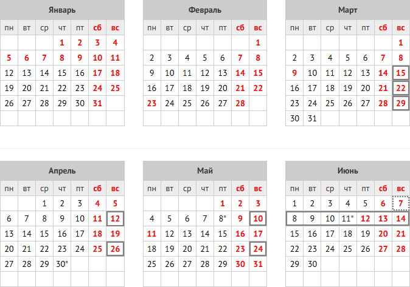

# Экзаменационный проект

 

## Календарный план

### До 15 марта:

Зарегистрировать состав команды заполнив [форму](https://forms.yandex.ru/u/69b0462d1f1eb554bcc642d7).

- форму заполняет лидер команды;
- состав команды: от 3 до 7 человек. В команду можно включать студентов ПИ независимо от группы;
- бренд: у команды должно быть название и лого. Элементы бренда должны присутствовать на презентационных материалах (презентация, видео) не менее одного раза.

### До 22 марта:

Определиться с темой проекта и найти заказчика, который будет заинтересован в реализации этого проекта. Тему и заказчика регистрируете через [форму](https://forms.yandex.ru/u/69b0577250569054b7abb192/).

Заказчиком может быть любой преподаватель КФУ. В случае если заказчик:

- не из ФТИ, команда получает +5 бонусных баллов за формирование межфакультативных связей;
- из ФТИ, но не с кафедры КИМ, команда получает +3 бонусных баллов за формирование межкафедральных связей;
- в остальных случаях, команда получает +1.

Если тема и заказчик зарегистрированы после дедлайна, команда не получает бонусных баллов.

### До 29 марта:

1. Командам необходимо подготовить видеоматериал, раскрывающий суть реализуемого проекта.

   В видео рекомендуется осветить следующие аспекты (не является строгим перечнем - команда может самостоятельно определить содержание):
   
   - суть задачи, которую решает проект;
   - планируемые результаты и ожидаемый эффект от реализации проекта;
   - причины выбора данной темы (мотивация, актуальность, личная заинтересованность и т. д.);
   - иные значимые детали, помогающие раскрыть идею проекта.
   
   Команда самостоятельно определяет формат подачи материала, например: видеопрезентация, живое выступление (запись с участием спикера/спикеров), анимационный ролик, скринкаст, комбинированный формат.
   
   Длительность: до 3-x минут.
   
   Ключевая задача: доступно и увлекательно донести до аудитории идею проекта, вызвать интерес и мотивировать поддержать вашу команду.
   
   Все видеоматериал будут выложен в группу кафедры в [ВК](https://vk.com/kimkfu) и, по истечении недели (6 апреля) командам будут начислены бонусные баллы:
   
   - 1 место: +5 бонусных баллов;
   - 2 место: +4 бонусных баллов;
   - 3 место: +3 бонусных баллов;
   - все остальные команды, **предоставившие видео**, - +1 бонусный балл.
   
   Место команды определяется по количеству голосов набранных видео-роликом. Голосование осуществляется путём выставления реакций (лайков) под публикациями с видео в группе КИМ в ВК. Тип реакции не имеет значения. Каждый участник группы КИМ в ВК может проголосовать за любое количество видеоматериалов.

2. Составить и согласовать "Техническое задание" с заказчиком проекта. Итоговый вариант ТЗ залить в мудл. Шаблон можно посмотреть [тут](./files/placeholder.md);

3. Составить и согласовать с заказчиком проекта "Календарный план работ по проекту". Итоговый вариант плана залить в мудл. Шаблон можно посмотреть [тут](https://docs.google.com/spreadsheets/d/1-HWE5mMgOsALLNEqpN5cEK3NiHZXBYKu75Cj9N4BhUg/edit?usp=drive_link);

4. Составить и согласовать с заказчиком проекта "Матрицу распределения ответственности по проекту". Итоговый вариант матрицы залить в мудл. Шаблон можно посмотреть [тут](https://docs.google.com/spreadsheets/d/1vfVSLxVYqjsodcUJCbaGyvCATwhJjKHnIeb0r3m85cU/edit?usp=drive_link);

   - что такое матрица ответственности и как её составлять можно посмотреть [тут](https://youtu.be/dZagyaf9XMk?si=JrzjIaN75brpQDnS);

   - не обязательно заполнять матрицу полностью, достаточно указать только ответственных (R) за выполнение;

   - по каждой задаче должен быть только один ответственный. Если задача большая, разбейте её на несколько подзадач;

   - в дополнение к классической RACI матрице для каждой задачи нужно указать её вес в стори поинтах (story point);

   - видео про стори поинты: [общая информация](https://youtu.be/IcyX43CAdiI), [пример](https://youtu.be/LlLK03gpiOg) (начиная с 12-й минуты по 21-ю);

\* *эти документы являются планом. В процессе работы возможны отклонения от плана: смещение сроков, добавление задач, смена исполнителя и т.п.* 

### До 12 апреля, 26 апреля, 10 мая, 24 мая:

В работе....

### До 7 июня:

В работе....

###  На последней неделе, до даты защиты:

В работе....

## Чек-лист

В работе....